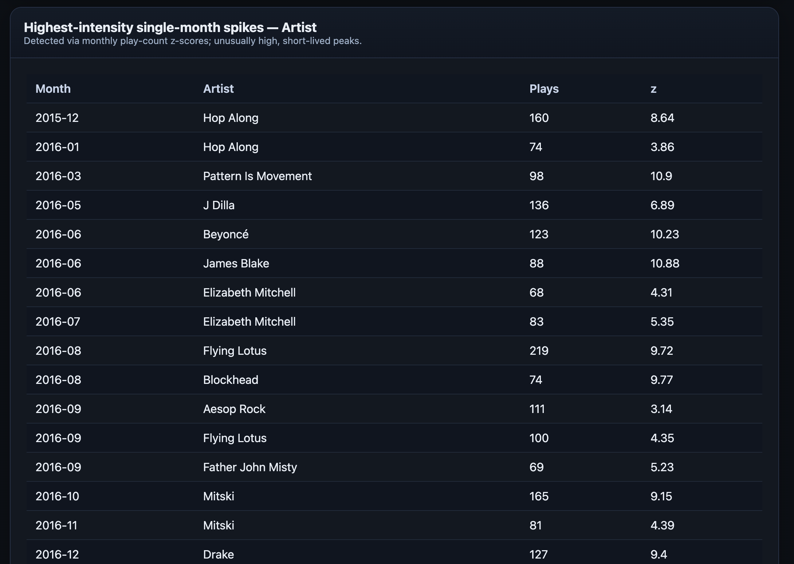
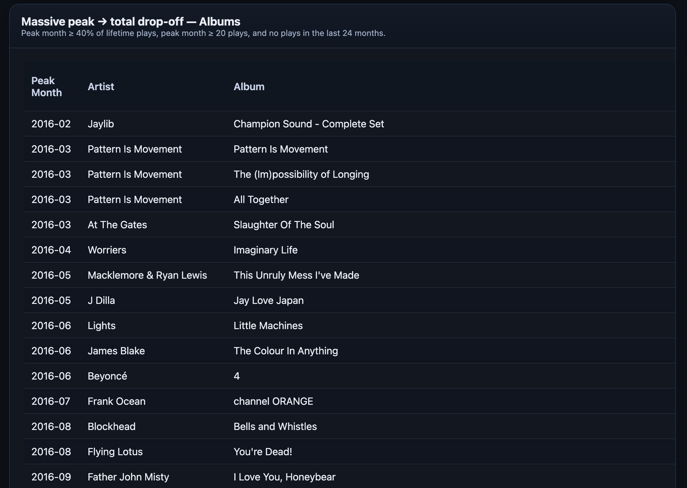

# Spotify Rediscovery Analyzer (CLI)

## Overview

Ever heard a song in a coffee shop and thought, "Oh wow, I used to LOVE this band!"? The Spotify Rediscovery Analyzer is your musical time machine, helping you reconnect with artists and albums that quietly slipped out of your rotation.

This isn't about tracking your current favorites—it's about uncovering the musical gems you've accidentally forgotten.

**Example Output**



**What Makes This Different:**
- Reveals your past musical love affairs
- Highlights artists you once adored but haven't heard in ages
- Uses data to spark musical nostalgia
- Helps you rediscover forgotten soundtracks of your life

**Perfect For:**
- Music lovers who enjoy revisiting old favorites
- Curious listeners who want to understand their evolving tastes
- Anyone who loves a trip down musical memory lane

## Features

- Deep analysis of Spotify streaming history
- Uncover forgotten musical phases
- Track how your music taste has evolved
- Generate detailed reports showing:
  - Periods of intense listening
  - Artists you've unconsciously drifted away from
  - Musical journeys you've forgotten

## Understanding Z-Scores: Mapping Your Musical Journey

### How Musical Rediscovery Works

Z-scores aren't just numbers—they're musical memories waiting to be rediscovered. They reveal those periods when an artist or album was your everything, before life gently nudged you toward new sounds. (For more on what exactly a Z-score means, read the detailed section below.)

**The Musical Rediscovery Cycle:**
1. **Intense Period**: You're completely immersed in an artist
2. **Gradual Fade**: Life moves on, other music takes over
3. **Rediscovery**: Years later, a random moment brings that music back

A high z-score (like 2.0) captures those intense musical moments:
- When an album was your constant companion
- Before you unconsciously drifted to new sounds
- Waiting to be rediscovered and appreciated again

**Real-World Example:**
- That indie band you played non-stop in 2018
- Forgotten until a café playlist reminds you how much you loved them
- Z-scores help you trace and relive those musical memories

## Requirements

- Python 3.x
- Spotify Extended Streaming History JSON files

## Installation

1. Ensure you have Python 3 installed
2. Clone this repository or download the script

## Usage

```bash
python spotify_rediscover_cli.py [OPTIONS] PATH
```

### Arguments

- `PATH`: Directory or glob pattern for StreamingHistory*.json files

### Options

- `--min-ms MIN`: Minimum milliseconds played to include (default: 0)
- `--exclude-podcasts`: Exclude podcast entries
- `--top N`: Number of top artists to display (default: 10)
- `--html FILE`: Write a full HTML report to specified path

### Examples

1. Basic usage:
```bash
python spotify_rediscover_cli.py ./spotify_history/
```

2. Generate HTML report:
```bash
python spotify_rediscover_cli.py ./spotify_history/ --html report.html
```

3. Exclude podcasts and set minimum play time:
```bash
python spotify_rediscover_cli.py ./spotify_history/ --exclude-podcasts --min-ms 30000
```

## HTML Report

When using the `--html` option, the script generates a comprehensive, interactive HTML report with:

- Top artists
- Listening intensity spikes
- Listening drop-offs
- Dormant artists
- One-album obsessions

The report features:
- Sortable tables
- Responsive design
- Detailed metadata
- Color-coded insights

## Understanding Z-Scores in Listening Patterns

### What is a Z-Score?

A z-score helps identify unusual listening patterns by measuring how far a month's play count is from the average. Think of it like this:

- If your typical monthly listening for an artist is around 50 plays
- One month you suddenly listen to 200 plays
- The z-score tells you how "unusual" or "intense" this spike is

**Simple Explanation:**
- Z-score of 0 means "typical" listening
- Z-score of 2.0 means "significantly higher than usual"
- Positive z-scores indicate more plays than average
- Negative z-scores indicate fewer plays than average

In this script, a z-score of 2.0 (default `SPIKE_Z`) means the month's listening is two standard deviations above your typical listening, flagging it as an intense listening period.

## Customization

You can adjust analysis parameters directly in the script:

- `SPIKE_Z`: Z-score threshold for detecting listening spikes
- `SPIKE_MIN_PLAYS`: Minimum plays for spike detection
- `DROP_PEAK_SHARE`: Threshold for detecting listening drop-offs
- And more...

## Project Setup

1. Clone the repository
2. Create a virtual environment:
   ```
   python3 -m venv venv
   source venv/bin/activate  # On Windows, use `venv\Scripts\activate`
   ```

3. Install the project in editable mode:
   ```
   pip install -e .
   ```

## Running Tests

To run the tests, use pytest:
```
python3 -m pytest tests
```

## Usage

Run the CLI tool with:
```
python3 -m src.spotify_rediscover_cli [options]
```

## Dependencies

- Python 3.8+
- pytest (for testing)

## Contributing

Contributions are welcome! Please feel free to submit a Pull Request.

## License

[MIT](https://opensource.org/license/mit)

## Author

Nick Cox